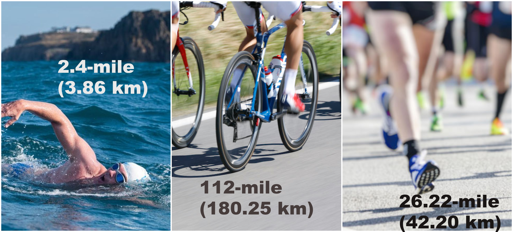

# Ironman Triathlon Competition Analysis
## Sheldon Sebastian

### Introduction

An Ironman Triathlon is one of a series of long-distance triathlon races organized by the World Triathlon Corporation (WTC), consisting of a 2.4-mile (3.86 km) swim, a 112-mile (180.25 km) bicycle ride and a marathon 26.22-mile (42.20 km) run, raced in that order.

All the 3 events are all conducted on same day and hence it is widely considered as one of the most difficult one-day sporting events in the world. Any participant who manages to complete the triathlon within these time constraints is designated an Ironman.

Ironman Triathlons are hosted across the world and competitors collect points to participate in Ironman World Championship held annually in Hawaii.

------------------------------------------------------------
### Analysis performed for following questions:
* What percentage of competitors finish the race?
* What is the change in overall competition time over the years?
* What is the performance difference between championship races and qualifying races?
* What are the performance differences between amateur competitors and professional competitors?
* What percentage of amateur racers overtook professional racers?
* How many participants are from various divisions?
* What is performance of a division?
* How does USA perform in comparison to the rest of the world?
* Which countries participate the most?
* Which countries perform the best in terms of overall time?

------------------------------------------------------------

Check following link for video explanation::

------------------------------------------------------------

### Conclusion
In conclusion, about 80% of participants complete the Ironman competition and in recent years this number is strongly growing. The overall completion time of the race is also decreasing and participants perform better in championship races than in non-championship races.

The PRO athlete performs better than an amateur athlete on average, but there is still a 33% chance that an amateur can overtake a professional in a race.

The most number of participants are from the 35-39-year-old age division, followed by 30-34-year-old age division. Other than the PRO division, the 30-34 year age division performs the best with the lowest race times. Thus an individual's age should not restrict oneself from participating in ironman.

Countries like the USA, Canada, Brazil, Australia, United Kingdom, Germany participate in higher numbers. Countries like Tanzania, Greenland, Australia, Germany, the United Kingdom have better overall race times.

------------------------------------------------------------
Links to view: [Jupyter Notebook](https://github.com/sheldonsebastian/ironman-competition-analysis/blob/master/Ironman%20Competition%20Analysis.ipynb), [Interactive Jupyter Notebook](https://nbviewer.jupyter.org/github/sheldonsebastian/ironman-competition-analysis/blob/71bc8cf96033fc9fe8de80cdf1cd157312419bc9/Ironman%20Competition%20Analysis.ipynb)
