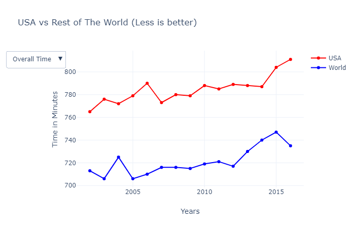

# Ironman Triathlon Competition Analysis
## Sheldon Sebastian

## Introduction

An Ironman Triathlon is one of a series of long-distance triathlon races organized by the World Triathlon Corporation (WTC), consisting of a 2.4-mile (3.86 km) swim, a 112-mile (180.25 km) bicycle ride and a marathon 26.22-mile (42.20 km) run, raced in that order.

All the 3 events are all conducted on same day and hence it is widely considered as one of the most difficult one-day sporting events in the world. Any participant who manages to complete the triathlon within these time constraints is designated an Ironman.

Ironman Triathlons are hosted across the world and competitors collect points to participate in Ironman World Championship held annually in Hawaii.

### 1. What percentage of competitors finish the race?

As ironman competitions are very tough and grueling we want to find the percentage of competitors who finished the race. We get count of participants who did not complete race by filtering overall column as DNS or Did not start, DNF = Did not finish and DQ = Disqualified.

We want to see how many percentage of people who completed championship and non championship races, so we divide our dataset into 2 parts, championship and non championship races.

From above pie plots, we conclude that majority of the participants who take part complete the ironman race. We also notice that there is higher race completion in championship races.

### 2. What is the change in overall competition time over the years?

We want to analyze the change in overall competition time, swim time, bike time and run time over the years.

We notice there is a downward trend in overall time for a participant to complete the race. There is very small variation of swim time over the years, it is in range of 74 to 78 minutes. Similarly bike time is in range of 370 to 380 minutes. The run time decreases over the years too, being the lowest at 278 minutes in 2012.

### 3. What is the performance difference between championship races and qualifying races?

We notice that overall time, swim time, bike time and run time for championship races are always less than non championship races over the years. A possible reason could be that in championship races, participants have already practiced ironman competition in non championship races, thus their performance could improve in championship races.

### 4. What are the performance differences between amateur competitors and professional competitors?

Since we have professional triathlon athletes competing with amateur competitors, we want to see the performance difference between them.

We notice that overall time, swim time, bike time and run time for professional athlete is always less than Amateur athlete over the years by a very significant margin.

### 5. What percentage of amateur racers overtook professional racers?

Although the average time over the years of a professional athlete is significantly less than an amateur we want to analyze, whether an amateur can overtake a professional and get a better overall rank.

Even though on average amateurs do not perform as good as professionals, from our analysis we notice that 33% the time, an amateur can overtake a pro in a race.

### 6. How many participants are from various divisions?

There are many age divisions in ironman competition, and there is also a separate division for PRO athletes. We want to analyze the number of participants from each division. Here we are only analyzing the participation count and not the participants finishing the competition.

We notice from above graph that most number of participants are from age division of 35-39 years, followed by 30-34 years. PRO athletes participating in race are 6th highest value and highlighted in red.

### 7. What is performance of a division?

From above graph we conclude that PRO athletes are the best performing division, followed by 30-34 age division, followed by 25-29 age division. Age cannot be a determining factor alone for performance, since here older participants perform better than younger participants.

### 8. How does USA perform in comparison to the rest of the world?

We now compare the overall performance time of USA with rest of the world.

From above charts we infer that USA has higher overall time, swim time, bike time and run time in comparison with rest of the world.

### 9. Which countries participate the most?

We want to know from which countries participate the most in ironman competition.

From choropleth we observe the highest participating countries are USA, Canada, Brazil, Australia, United Kingdom, Spain, France, Germany, Argentina and South Africa.

### 10. Which countries perform the best in terms of overall time?

We want to know from which countries perform the best in ironman competition.

From choropleth the highest performing countries are colored in red which are Tanzania, Central Africa Republic, Greenland and most of the European countries like Germany, Ukraine, Belarus, Switzerland.

## Conclusion
In conclusion, about 80% of participants complete the Ironman competition and in recent years this number is strongly growing. The overall completion time of the race is also decreasing and participants perform better in championship races than in non-championship races.

The PRO athlete performs better than an amateur athlete on average, but there is still a 33% chance that an amateur can overtake a professional in a race.

The most number of participants are from the 35-39-year-old age division, followed by 30-34-year-old age division. Other than the PRO division, the 30-34 year age division performs the best with the lowest race times. Thus an individual's age should not restrict oneself from participating in ironman.

Countries like the USA, Canada, Brazil, Australia, United Kingdom, Germany participate in higher numbers. Countries like Tanzania, Greenland, Australia, Germany, the United Kingdom have better overall race times.

------------------------------------------------------------

Check following link for video explanation::

Links to view: [Jupyter Notebook](https://github.com/sheldonsebastian/ironman-competition-analysis/blob/master/Ironman%20Competition%20Analysis.ipynb), [Interactive Jupyter Notebook](https://nbviewer.jupyter.org/github/sheldonsebastian/ironman-competition-analysis/blob/71bc8cf96033fc9fe8de80cdf1cd157312419bc9/Ironman%20Competition%20Analysis.ipynb)
